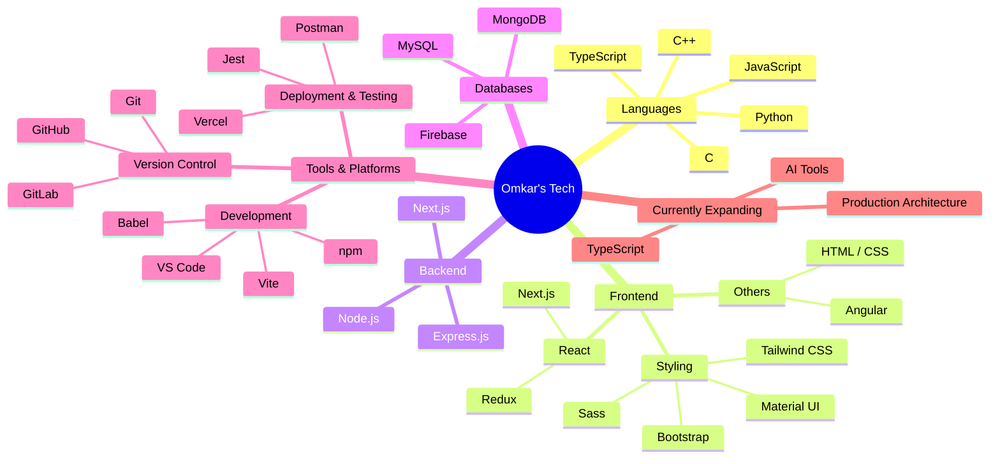

  <h1>Hello👋, Welcome to my profile! </h1>

 

  

 

 
 

    An innovative <strong>Software Engineer</strong> passionate about building scalable, user-centric web applications using the <strong>MERN Stack (MongoDB, Express.js, React, Node.js)</strong> and modern web technologies.
  

  
  &nbsp;&nbsp;
  
  &nbsp;&nbsp;
  
  &nbsp;&nbsp;
  
    
  

 

  

##  About Me

Hey, I’m **Omkar** — a Full-Stack Developer who loves turning complex ideas into clean, high-performing web products.

I specialize in the **MERN stack** and modern frontend tooling, with a strong focus on building applications that are both scalable and delightful to use.

- 🚀 **Full-Stack Craftsmanship** — Designing and shipping end-to-end solutions with  
- 🎨 **Design-Conscious Development** — Creating polished, responsive interfaces using 
- ⚡ **Performance & Clean Code** — Writing maintainable systems with proper architecture, documentation, and optimization in mind
- 📚 **Always Evolving** — Currently deepening expertise in  and exploring AI tools to accelerate development
- 🤝 **Collaborative Mindset** — Enjoy working with teams, mentoring, and building products that create real impact

Based in **Pune, India** · Open to meaningful collaborations and opportunities that challenge me to grow.

  

 

##  What I’m Building

<table>
  <tr>
    <!-- SnapCart -->
    <td align="center" width="33%" valign="top">
        
      <strong>🛒 SnapCart</strong> 
      Multi-vendor e-commerce platform  
      <code>React</code> <code>Node</code> <code>TS</code> <code>Mongo</code>  
      
      
    </td>
     <!-- AuthForge -->
    <td align="center" width="33%" valign="top">
        
      <strong>🔐 Secure AuthForge</strong> 
      Production-ready MERN auth system  
      <code>JWT</code> <code>OAuth2</code> <code>Express</code> <code>TS</code>  
      
      
    </td>
    <!-- What's Next -->
    <td align="center" width="33%" valign="top">
        
      <strong>⚡ What's Next</strong> 
      Skills currently in progress  
      <code>Python</code> <code>TS</code> <code>LLMs</code> <code>AI Tools</code>  
      
    </td>
  </tr>
</table>

  

##  Tech Arsenal

  <h3>Languages</h3>
  
  
  <h3>Frontend</h3>
  
  
  <h3>Backend & Databases</h3>
  
  
  <h3>Tools & Platforms</h3>
  

 

<b>🎯 Click for Detailed Tech Stack</b>

 

##  Featured Projects

> I love building real-world applications that solve actual problems.  
From full-stack e-commerce platforms to production-ready authentication systems — every project is crafted with clean architecture, performance, and user experience in mind.

 

##  GitHub Metrics

  
  

 

  

 

  

 

  

##  Let’s Connect

> I’m always open to meaningful conversations, collaboration, and building something impactful together.

> Whether you want to discuss a project idea, talk about tech, collaborate on something cool, or just say hi — feel free to reach out. I usually reply within 24 hours.

 

  
  
  
  
  

 

<table width="100%" border="0" cellpadding="0" cellspacing="0" style="border-collapse: collapse; border: none;">
  <tr style="border: none;">
    <td width="60%" align="left" valign="middle" style="border: none; padding-right: 10px;">
      

        💼 Prefer LinkedIn for professional talks 
        🐦 Twitter for quick thoughts & tech updates 
        📧 Email for detailed discussions 
        💬 Discord for casual chats
      

    </td>
    <td width="40%" align="right" valign="middle" style="border: none;">
      
    </td>
  </tr>
</table>

<!-- Snake Animation -->

  

 

  

 

  
⭐️ If you like my work, consider starring some of my repositories — it genuinely helps and keeps me motivated to build more.

  
Thanks for stopping by. Let’s create something remarkable together.

  
  
  

