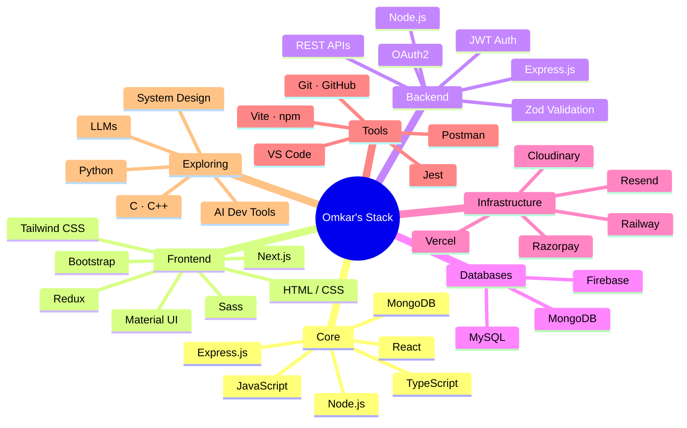

<!-- ============================================================
     OMKAR KARALE — GitHub Profile README
     ============================================================ -->

  

  

 

  

 

  
  &nbsp;
  
  &nbsp;
  

 

    
  

<!--  -->

##  About Me

Hey, I'm **Omkar** — a Full-Stack Developer who turns complex ideas into clean, high-performing web products.

I work across the full stack — designing APIs, shaping database architecture, building responsive interfaces, and tightening performance, security, and maintainability as I go. My focus is on shipping things that are production-ready, not just functional.

- 🚀 **Full-Stack Craftsmanship** — End-to-end solutions with 
- 🎨 **Design-Conscious Development** — Polished, responsive interfaces using 
- ⚡ **Performance & Architecture** — Maintainable systems built with proper structure, security, and documentation in mind
- 📚 **Always Evolving** — Deepening expertise in  and exploring AI tooling to accelerate development
- 🤝 **Collaborative by Default** — I like working with teams, building things that create real impact, and helping others grow

Based in **Pune, India** · Open to meaningful collaborations and opportunities that challenge me.

  

 

  

##  Featured Projects

<table>
  <tr>
    <td align="center" width="33%" valign="top">
        
      <strong>🛒 SnapCart</strong> 
      Multi-vendor e-commerce platform  
      <code>React</code> <code>Node</code> <code>TypeScript</code> <code>MongoDB</code> 
      <code>Razorpay</code> <code>Cloudinary</code> <code>Railway</code>  
      
      
    </td>
    <td align="center" width="33%" valign="top">
        
      <strong>🔐 AuthForge</strong> 
      Production-ready MERN auth boilerplate  
      <code>JWT</code> <code>OAuth2</code> <code>Express</code> <code>TypeScript</code> 
      <code>Refresh Rotation</code> <code>Zod</code>  
      
      
    </td>
    <td align="center" width="33%" valign="top">
        
      <strong>⚡ Currently Exploring</strong> 
      Skills I'm actively deepening  
      <code>Python</code> <code>LLMs</code> <code>AI Tools</code> 
      <code>System Design</code>  
      
    </td>

  </tr>
</table>

 

 

##  Tech Arsenal

  

 

<h3>⚙️ Core Stack</h3>

<em>Technologies I build production systems with daily</em>

<h3>🎨 Frontend</h3>

<h3>🗄️ Backend & Databases</h3>

<h3>🛠️ Tools & Platforms</h3>

<h3>🔭 Currently Exploring</h3>

<em>Actively learning and expanding into</em>

 

<b>🎯 Full Tech Map (Mermaid Mindmap)</b>

 

 

  

##  GitHub Metrics

  
  

 

  

 

  

 

  

##  Let's Connect

> I'm always open to meaningful conversations, collaborations, and building something impactful together.  
> Project idea, tech discussion, or just a hello — feel free to reach out. I usually reply within 24 hours.

 

   
  
  

  
  &nbsp;
  
  &nbsp;
  
  &nbsp;
  
  &nbsp;
  

 

  

 

  

 

  
⭐️ If you like my work, consider starring some of my repositories — it genuinely helps and keeps me motivated to build more.

  
Thanks for stopping by. Let’s create something remarkable together.

    
  

